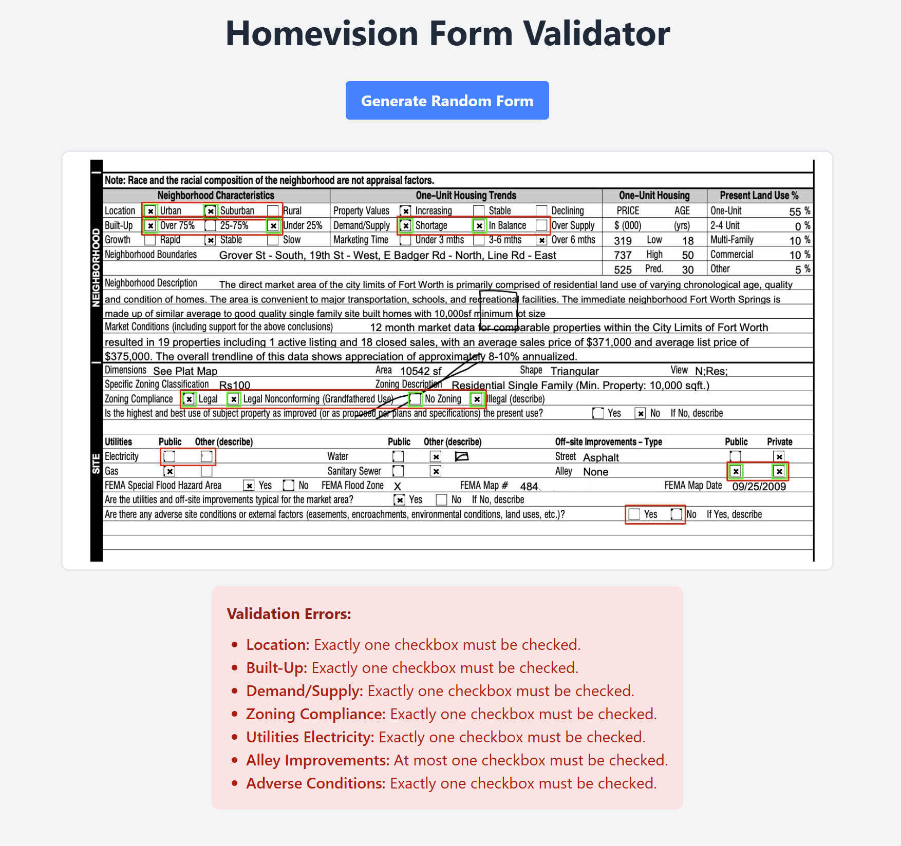

# Homevision Form Validator

## Try It Online

You can try it at:
[http://homevision-form-validator.s3-website-sa-east-1.amazonaws.com/](http://homevision-form-validator.s3-website-sa-east-1.amazonaws.com/)
## 

Hi there!

I’ve been learning about Homevision and noticed that you often work with a variety of documents and images. This inspired me to create a checkbox detection system to improve your workflows.

---

## What It Does

This tool is designed to work with forms based on a predefined template. Users can:

- Define which checkboxes are grouped together.
- Set specific validation rules for these groups.

When a form is validated, the system will ensure that all specified rules are met. If any issues are found, the validator will:

- Display a clear bullet-point list of errors.
- Highlight the problematic groups with red rectangles, making it easy to see which checkboxes were recognized as checked and violated the rules.

---

## Why It’s Useful

The **Homevision Form Validator** follows a fail-fast approach. It helps users quickly identify and resolve errors before uploading forms to the system. This minimizes wasted time and ensures that forms meet all requirements on the first try.

---

## How to Run

### 1. Launch the Backend (BE)

- Navigate to the backend directory:  
  `cd vision-be`

- Install the required dependencies:  
  `pip install opencv-python numpy matplotlib flask flask-cors`

- Start the backend server:  
  `python controller.py`

---

### 2. Launch the Frontend (FE)

- Navigate to the frontend directory:  
  `cd vision-fe`

- Install the required dependencies:  
  `npm install`

- Start the development server:  
  `npm run dev`

---

### 3. Open the Application

Once both the backend and frontend servers are running, open your browser and navigate to:  
[http://localhost:5173/](http://localhost:5000/)
